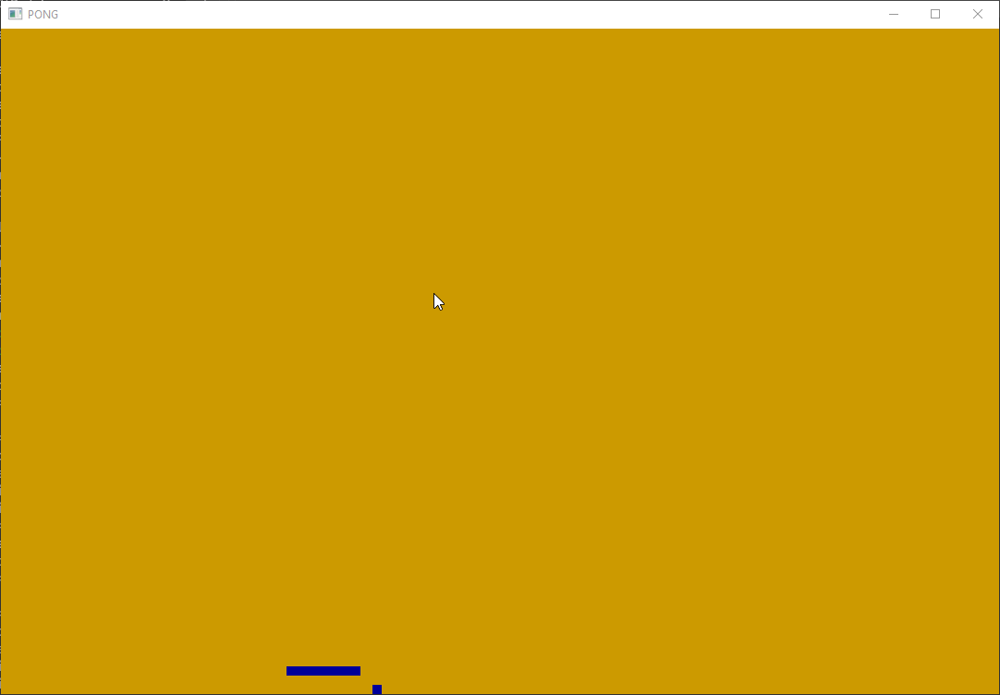

# PHP pong

## Play it

- Download the latest release or clone the repo.
- Run `composer i`.
- Run `php ./play.php`.

### Control

- `SPACE` to start.
- `ESCAPE` to quit.
- Arrows to move the pad.

### Requirements

- PHP 8.1.
- Composer.
- [glfw](https://phpgl.net/getting-started/getting-started-with-php-and-opengl.html) PHP extension.

## Contributing

Anything is welcome :)
